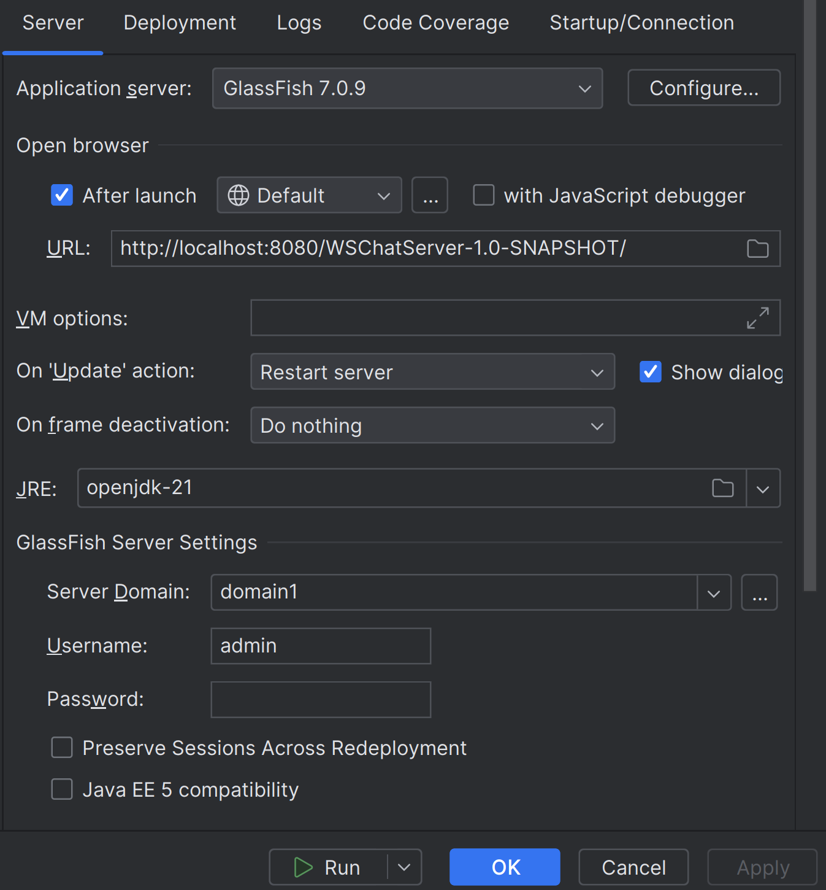

# Assignment 02 - Web Chat Server 
> Course: CSCI 2020U: Software Systems Development and Integration

## Project Information

#### Authors: Charis Chan, Beatriz Provido, Gordon Law, Jerico Robles

This is a web chat server where you can create multiple rooms. It allows you and your friends to chat privately.

A video demo can be found [here](https://youtu.be/BoS4pjF-Gak): 

## Improvements

### Backend

- Server list automatically refreshes when there's a new room
- Send message button

### Frontend

- Colors and fonts/font sizes
- Project information
- If roomlist gets too big, the roomlist becomes scrollable
- Animation when the cursor hovers over a clickable button
- Send message button

## How to run

### Step 1: Obtain the repository link

Go to the Github page here: https://github.com/OntarioTech-CS-program/w24-csci2020u-assignment02-chan-provido-law-robles

And navigate to the 'Clone button'

Copy the 'https:// link' there or from here: `https://github.com/OntarioTech-CS-program/w24-csci2020u-assignment02-chan-provido-law-robles.git`

### Step 2: Clone the repository locally

If it's not already set up, instructions for setting up IntelliJ here: (link here maybe)

Open IntelliJ and click 'Get from VCS' in the top right

Paste the URL into the URL input box and select the directory to clone the repository into. Click clone when you're satisfied.

### Step 3: Set up the project in IntelliJ

Once the project opens, go to the run menu and click 'Edit Configurations'

Click 'Add new configuration' (the '+' symbol) under the configuration menu, and select 'Glassfish Server -> Local'

Fill in the 'URL', 'JRE', and 'Server Domain' like in the screenshot below:

Go to the 'Deployment' tab and select 'Artifact', followed by 'WSChatServer:war exploded'. Click 'Apply' then 'OK'

### Step 4: 

Click on the green play button besides the GlassFish version in the top right and wait for the webpage to open

## Other resources

lorem ipsum

## Contribution report:

lorem ipsum
jerico robles: 5%